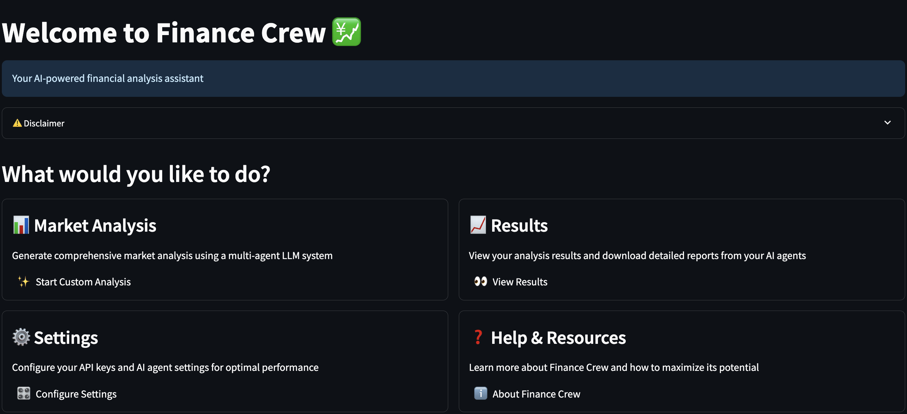
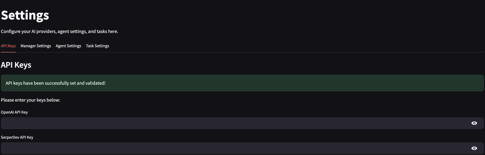
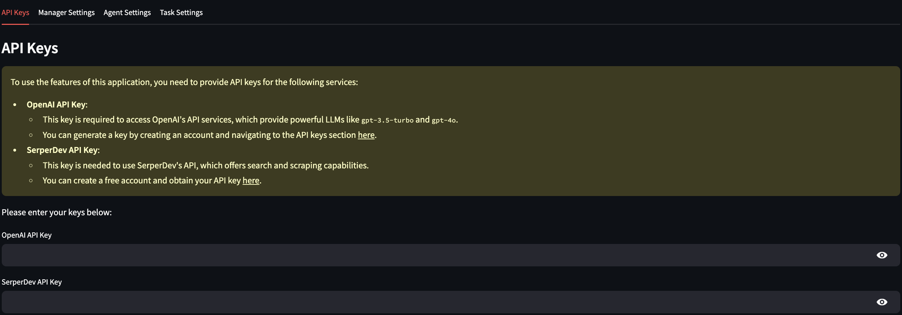
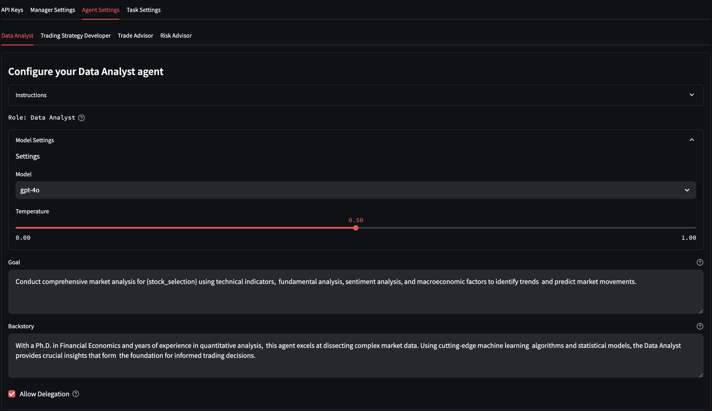
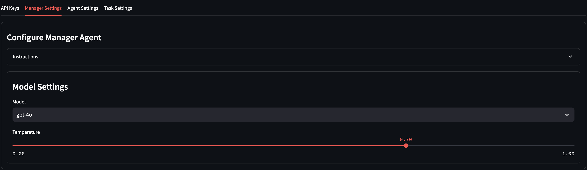
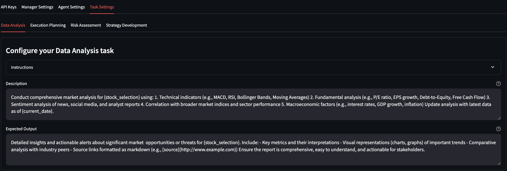
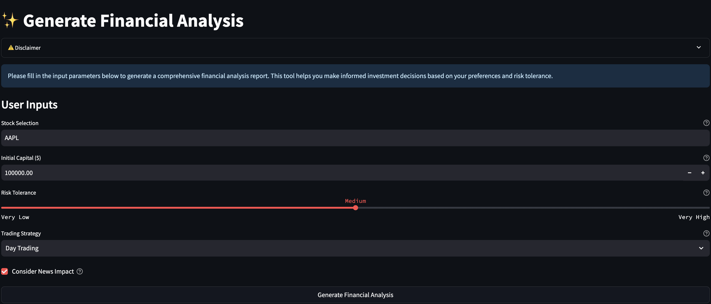
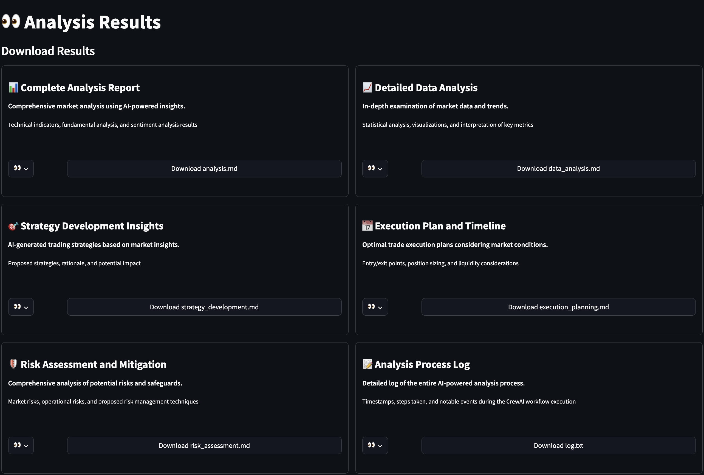

# FinanceCrew Web Application User Guide

## Introduction

FinanceCrew is an AI-powered tool designed to assist day traders in analyzing markets, developing strategies, and managing risks. This guide will walk you through using the FinanceCrew web application.

## Getting Started

See the [README.md](README.md) file for installation instructions and prerequisites. Once you have the application running, you can access it through your web browser.

## Main Dashboard

Upon launching the application, you'll see the main dashboard with four main sections:

1. Market Analysis
2. Results
3. Settings
4. Help & Resources

## Configuring Settings

Before generating an analysis, ensure your settings are configured correctly:

1. Click on the "Settings" section.
2. You'll see four tabs: API Keys, Agent Settings, Manager Settings, and Task Settings.

### API Keys

1. Navigate to the "API Keys" tab.
2. Enter your OpenAI API Key and SerperDev API Key.
3. Click "Save" to store your API keys securely.

### Agent Settings

1. Go to the "Agent Settings" tab.
2. Here you can configure:
   - Agent Types: Select which AI agents to use in your analysis
   - Agent Parameters: Adjust specific settings for each agent type
   - Collaboration Settings: Define how agents interact and share information
3. Click "Save" to apply your agent settings.

### Manager Settings

1. Navigate to the "Manager Settings" tab.
2. Configure the following:
   - Task Allocation: Set how tasks are distributed among agents
   - Priority Levels: Define priority levels for different types of tasks
   - Oversight Parameters: Adjust how the manager oversees and intervenes in agent activities
3. Click "Save" to apply your manager settings.

### Task Settings

1. Go to the "Task Settings" tab.
2. Here you can set up:
   - Task Types: Define the types of tasks that can be assigned to agents
   - Time Limits: Set maximum time limits for task completion
   - Output Formats: Specify the required format for task outputs
3. Click "Save" to apply your task settings.

## Generating a Financial Analysis

To create a new financial analysis:

1. Click on the "Market Analysis" section.
2. Fill in the following parameters:
   - Stock Selection: Enter the stock symbol (e.g., AAPL for Apple Inc.)
   - Initial Capital: Enter the amount of capital you're starting with
   - Risk Tolerance: Use the slider to set your risk tolerance from Very Low to Very High
   - Trading Strategy: Select your preferred trading strategy from the dropdown
   - Consider News Impact: Check this box if you want the analysis to include recent news
3. Click the "Generate Financial Analysis" button to start the process.

## Viewing Analysis Results

Once the analysis is complete, you can access the results:

1. Navigate to the "Results" section.
2. You'll see several downloadable reports:
   - Complete Analysis Report
   - Detailed Data Analysis
   - Strategy Development Insights
   - Execution Plan and Timeline
   - Risk Assessment and Mitigation
   - Analysis Process Log

3. Click on the download button next to each report to view or save the content.

## Interpreting the Results

Each report provides specific insights:

- **Complete Analysis Report**: Offers a comprehensive overview of all aspects of the analysis.
- **Detailed Data Analysis**: Provides in-depth examination of market data and trends.
- **Strategy Development Insights**: Outlines AI-generated trading strategies based on the analysis.
- **Execution Plan and Timeline**: Suggests optimal trade execution considering market conditions.
- **Risk Assessment and Mitigation**: Evaluates potential risks and proposes safeguards.
- **Analysis Process Log**: Details the steps taken during the AI-powered analysis process.

## Help & Resources

For additional information about FinanceCrew, you can also access the [GitHub repository](hhttps://github.com/alexnodeland/finance-crew) and [LinkedIn post](https://www.linkedin.com/feed/update/urn:li:activity:7211752576269062146/) for more details and updates.

## Important Notes

- Remember that FinanceCrew is an educational tool and should not be used for real-world trading decisions.
- Always review the disclaimer before using the tool for any purpose.
- If you encounter any issues or have questions, refer to the GitHub repository for support or to report problems.

By following this guide, you should be able to navigate the FinanceCrew web application effectively, generate financial analyses, and interpret the results provided by the AI-powered system.