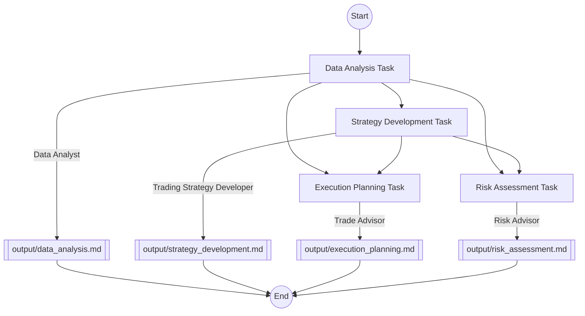

```
░▒▓████████▓▒░▒▓█▓▒░▒▓███████▓▒░ ░▒▓██████▓▒░░▒▓███████▓▒░ ░▒▓██████▓▒░░▒▓████████▓▒░▒▓██████▓▒░░▒▓███████▓▒░░▒▓████████▓▒░▒▓█▓▒░░▒▓█▓▒░░▒▓█▓▒░ 
░▒▓█▓▒░      ░▒▓█▓▒░▒▓█▓▒░░▒▓█▓▒░▒▓█▓▒░░▒▓█▓▒░▒▓█▓▒░░▒▓█▓▒░▒▓█▓▒░░▒▓█▓▒░▒▓█▓▒░     ░▒▓█▓▒░░▒▓█▓▒░▒▓█▓▒░░▒▓█▓▒░▒▓█▓▒░      ░▒▓█▓▒░░▒▓█▓▒░░▒▓█▓▒░ 
░▒▓█▓▒░      ░▒▓█▓▒░▒▓█▓▒░░▒▓█▓▒░▒▓█▓▒░░▒▓█▓▒░▒▓█▓▒░░▒▓█▓▒░▒▓█▓▒░      ░▒▓█▓▒░     ░▒▓█▓▒░      ░▒▓█▓▒░░▒▓█▓▒░▒▓█▓▒░      ░▒▓█▓▒░░▒▓█▓▒░░▒▓█▓▒░ 
░▒▓██████▓▒░ ░▒▓█▓▒░▒▓█▓▒░░▒▓█▓▒░▒▓████████▓▒░▒▓█▓▒░░▒▓█▓▒░▒▓█▓▒░      ░▒▓██████▓▒░░▒▓█▓▒░      ░▒▓███████▓▒░░▒▓██████▓▒░ ░▒▓█▓▒░░▒▓█▓▒░░▒▓█▓▒░ 
░▒▓█▓▒░      ░▒▓█▓▒░▒▓█▓▒░░▒▓█▓▒░▒▓█▓▒░░▒▓█▓▒░▒▓█▓▒░░▒▓█▓▒░▒▓█▓▒░      ░▒▓█▓▒░     ░▒▓█▓▒░      ░▒▓█▓▒░░▒▓█▓▒░▒▓█▓▒░      ░▒▓█▓▒░░▒▓█▓▒░░▒▓█▓▒░ 
░▒▓█▓▒░      ░▒▓█▓▒░▒▓█▓▒░░▒▓█▓▒░▒▓█▓▒░░▒▓█▓▒░▒▓█▓▒░░▒▓█▓▒░▒▓█▓▒░░▒▓█▓▒░▒▓█▓▒░     ░▒▓█▓▒░░▒▓█▓▒░▒▓█▓▒░░▒▓█▓▒░▒▓█▓▒░      ░▒▓█▓▒░░▒▓█▓▒░░▒▓█▓▒░ 
░▒▓█▓▒░      ░▒▓█▓▒░▒▓█▓▒░░▒▓█▓▒░▒▓█▓▒░░▒▓█▓▒░▒▓█▓▒░░▒▓█▓▒░░▒▓██████▓▒░░▒▓████████▓▒░▒▓██████▓▒░░▒▓█▓▒░░▒▓█▓▒░▒▓████████▓▒░░▒▓█████████████▓▒░ 

Your day trading copilot, with AI-powered insights and analytics.

⚠️ See Disclaimer before using this tool.
```

# 🚀 FinanceCrew

FinanceCrew is an AI-powered tool that helps day traders analyze markets, develop strategies, and manage risks using [CrewAI](https://github.com/joaomdmoura/crewAI).

## 📋 Table of Contents
- [Workflow](#-workflow)
- [Diagram](#-diagram)
- [Installation](#-installation)
- [Usage](#-usage)
- [Contributing](#-contributing)
- [Thanks](#-thanks)
- [Disclaimer](#-disclaimer)

## ✨ Workflow

FinanceCrew streamlines your day trading process through four key steps:

1. 📊 **Market Analysis**: Conducts comprehensive market analysis using technical indicators, fundamental analysis, and sentiment analysis.
2. 💡 **Strategy Development**: Develops and refines trading strategies based on market insights and user preferences.
3. 📈 **Execution Planning**: Designs optimal trade execution plans considering market conditions and liquidity.
4. 🛡️ **Risk Assessment**: Evaluates and quantifies risks associated with proposed trading activities.

Each step is powered by AI to provide you with tailored, insightful results for your day trading activities.

## 📊 Diagram



## 🛠️ Installation

1. Clone the repository:

```sh
git clone https://github.com/alexnodeland/finance-crew.git
```

2. Install the dependencies, using [Poetry](https://python-poetry.org/).

```sh
poetry install
```

## 🚀 Usage

You have two options to run the application:

1. Using the automated script (recommended):

   Run the `run.sh` script:

    ```sh
    ./run.sh
    ```

   This script will:
   - Check for Poetry installation and install it if necessary
   - Install or update dependencies
   - Prompt you to choose between running the CLI or web application
   - Handle environment setup automatically

2. Manual execution:

   a. Copy the `.env.example` file to `.env` and fill in the required environment variables.

   b. (Optional) Modify the `data/cli-default.json` file to customize defaults for your specific data.

   c. Run the desired application:

   - For the CLI application:

        ```sh
        poetry run finance-crew-cli
        ```

     Follow the CLI prompts or press `Enter` to use the default values from `cli-default.json`.

   - For the web application:

        ```sh
        poetry run finance-crew-app
        ```

     Open your browser and navigate to `http://localhost:8501` to access the web application.
    
The automated script is recommended for most users as it simplifies the setup process.

For more detailed instructions on usage of the web app, refer to the [User Guide](GUIDE.md).

## 🤝 Contributing

Contributions are welcome! Please read the [contributing guidelines](CONTRIBUTING.md) first.

## 🙏 Thanks

This project was adapted from an example in the course [Multi AI Agent Systems with crewAI](https://www.deeplearning.ai/short-courses/multi-ai-agent-systems-with-crewai/). I would like to extend our gratitude to the course creators [João Moura](https://github.com/joaomdmoura), [CrewAI](https://www.crewai.com/), and [Deeplearning.AI](https://www.deeplearning.ai/) for providing such a comprehensive and insightful resource.

## ⚠️ Disclaimer

**IMPORTANT**: FinanceCrew is an experimental tool designed for educational and research purposes only. It should not be used for real-world trading or financial decision-making. The insights and recommendations provided by this tool do not constitute financial advice and should not be interpreted as such.

- This tool is not licensed or regulated by any financial authority.
- The accuracy and reliability of the AI-generated insights have not been independently verified.
- Trading in financial markets carries significant risks, including the potential loss of your invested capital.
- Always consult with a qualified financial advisor before making any investment decisions.

By using FinanceCrew, you acknowledge that you understand these risks and agree to use this tool solely for educational or experimental purposes.
